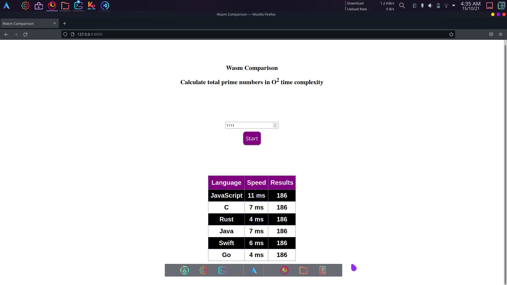

# Wasm-Comparison

## Comparing speed on web, Wasm vs JavaScript

### Compares between 6 languages:-
    JavaScript
    C
    Rust
    Java
    Swift
    Go
    
## For running locally, run through a local servereg:- 
```python -m http.server 8000 --bind 127.0.0.1```
    
## Usage:-
  
